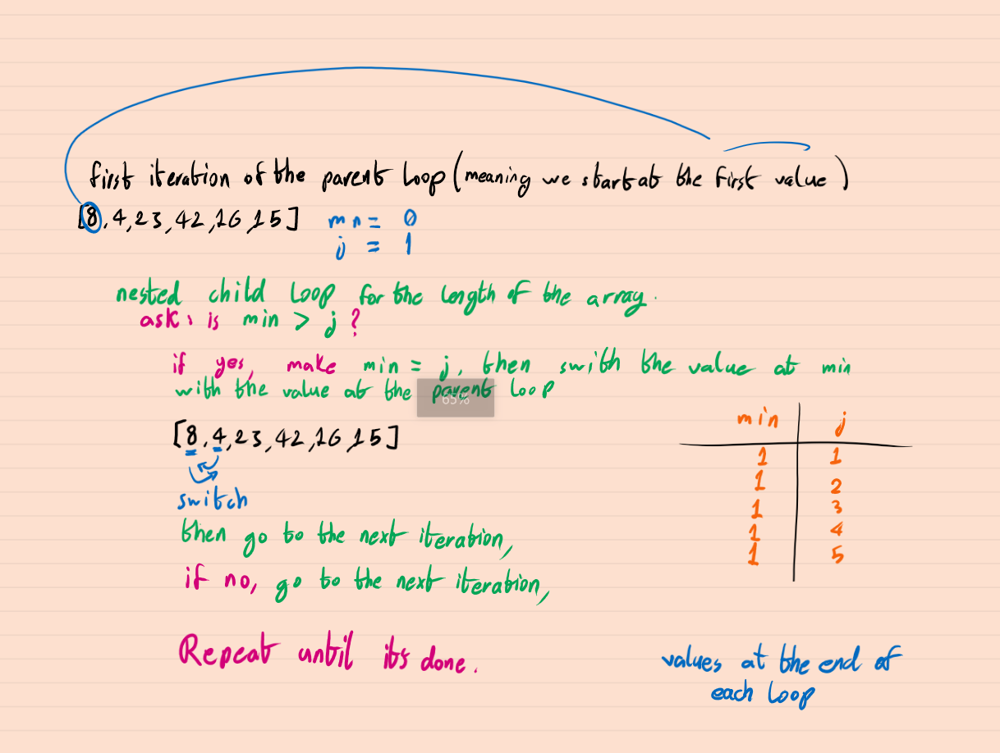
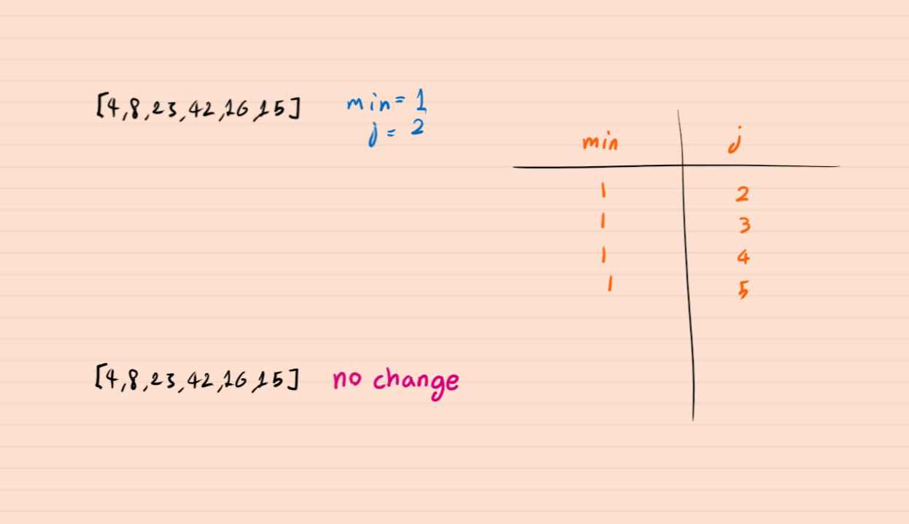
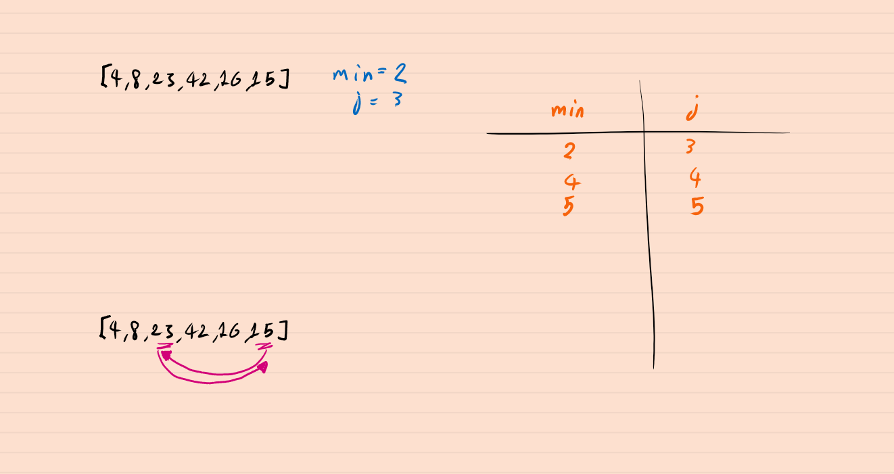
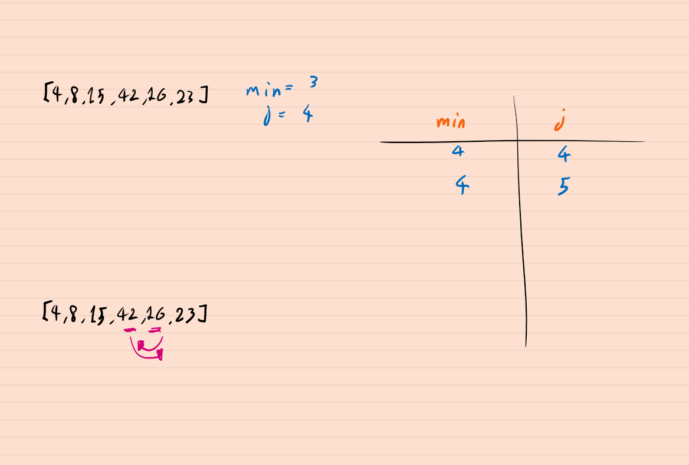
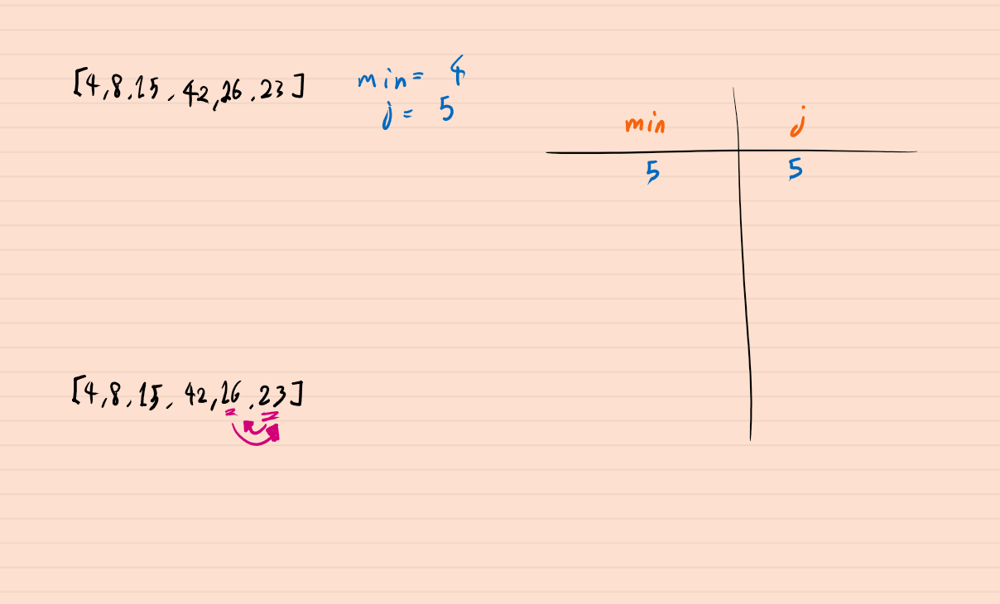

# insertion-sort

Selection Sort is a sorting algorithm that traverses the array multiple times as it slowly builds out the sorting sequence. The traversal keeps track of the minimum value and places it in the front of the array which should be incrementally sorted.

## Pseudo Code

```
SelectionSort(int[] arr)
    DECLARE n <-- arr.Length;
    FOR i = 0; i to n - 1
        DECLARE min <-- i;
        FOR j = i + 1 to n
            if (arr[j] < arr[min])
                min <-- j;

        DECLARE temp <-- arr[min];
        arr[min] <-- arr[i];
        arr[i] <-- temp;
```

## BLOG
We will go through an example step by step, we are going to run `[8,4,23,42,16,15]` through the function and see how it changes through each step.

- step 1

- step 2

- step 3

- step 4

- step 5

 
 <br />
 <br />

 this results in a an array that looks like this `[4,8,15,16,23,42]`.

[Go to table of contents](https://suhaib-ersan.github.io/401-data-structures-and-algorithms)
