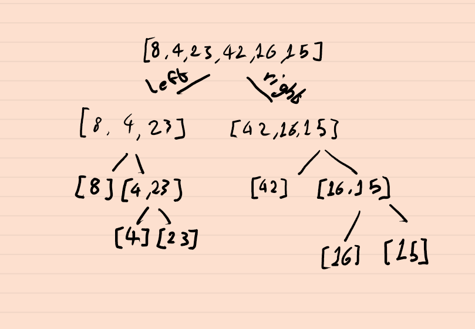
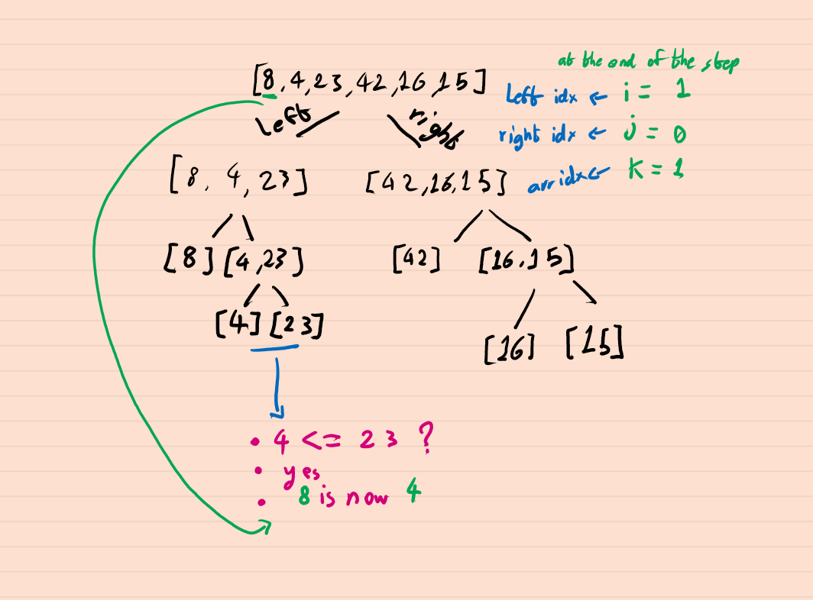
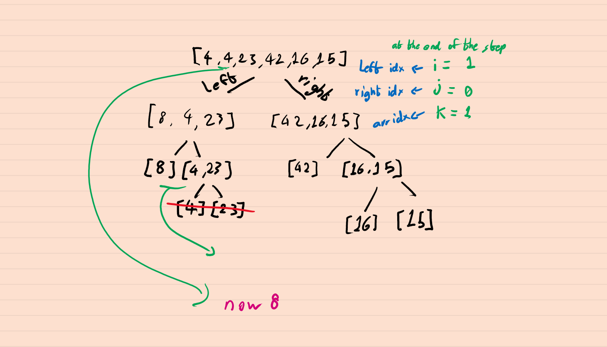
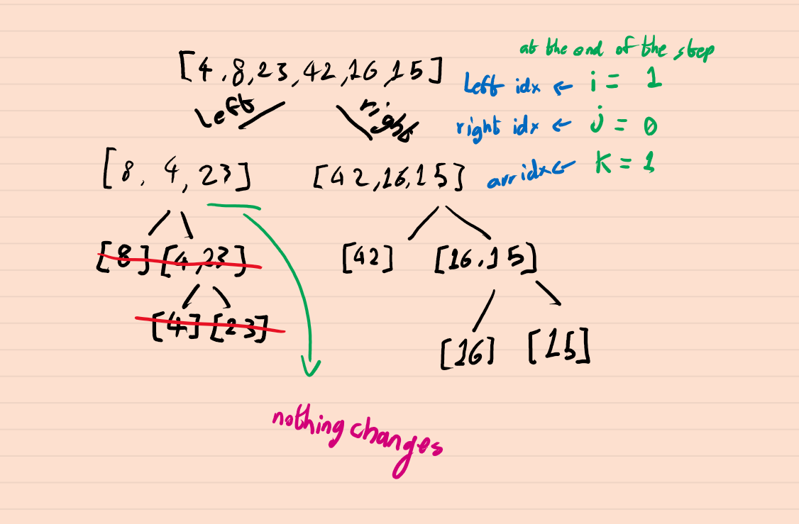
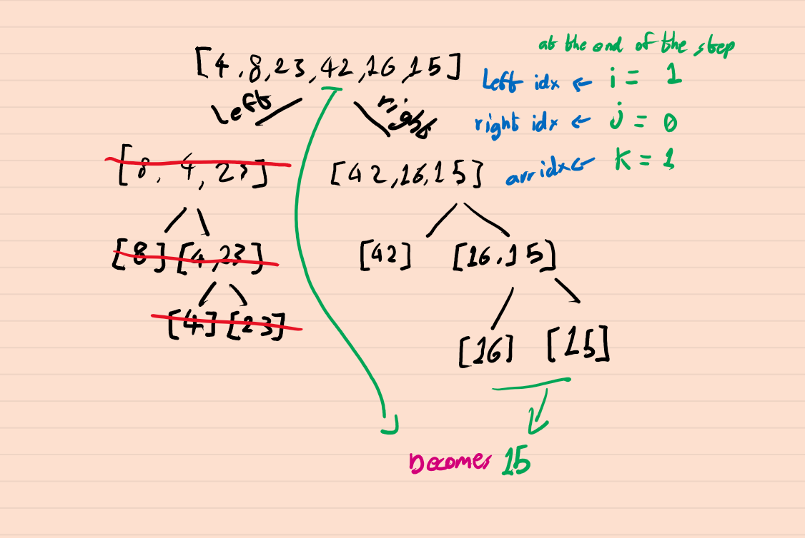
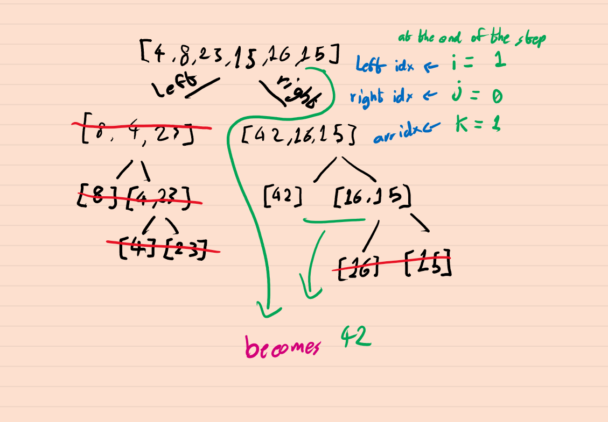
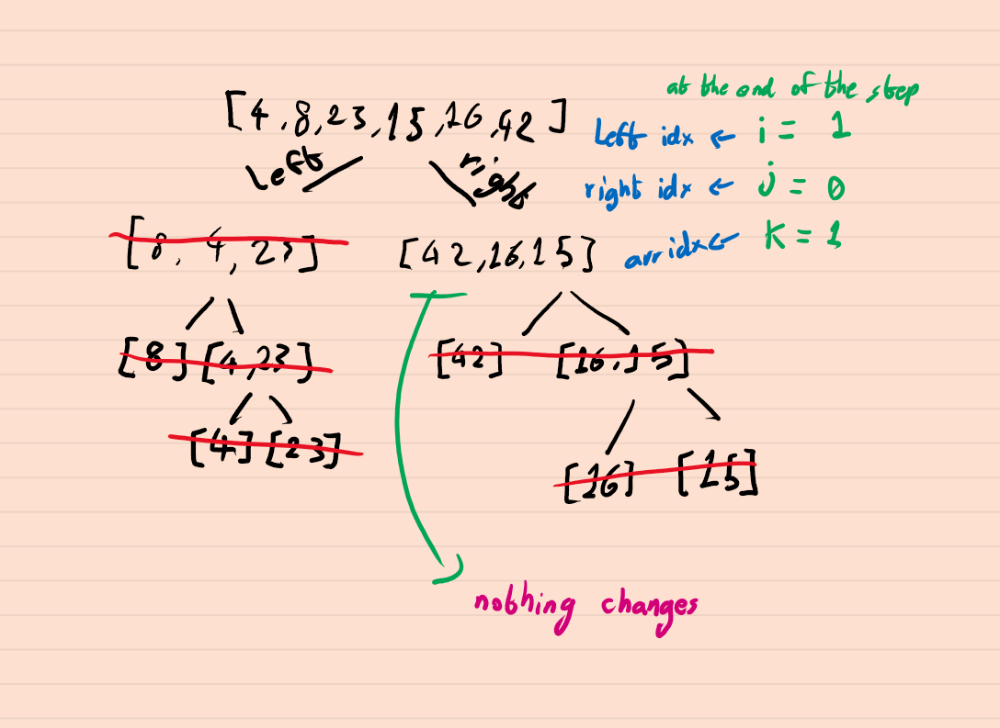
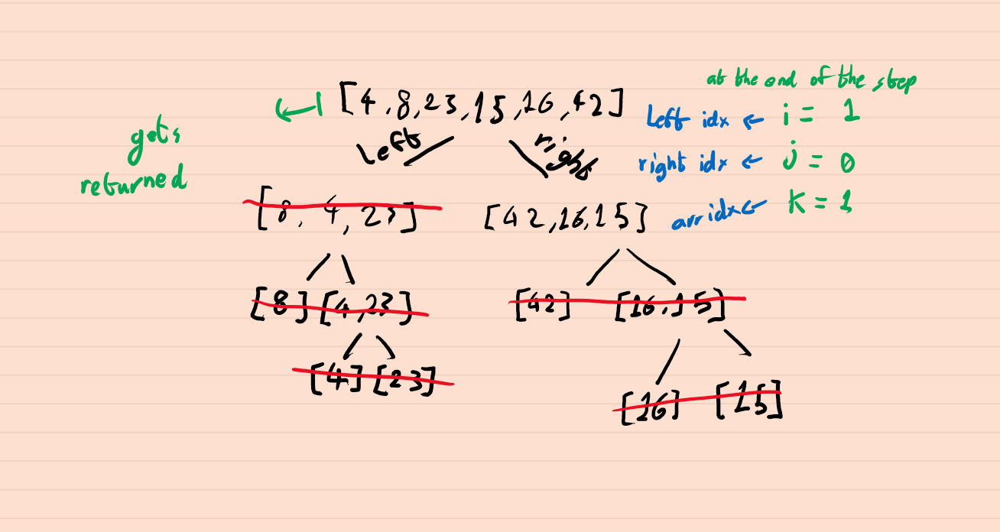

# merge-sort

Merge Sort is a sorting algorithm that traverses the array multiple times as it slowly builds out the sorting sequence. The traversal keeps cutting the array in half until it's only 1 element long, then it compares those halves and replaces the original arr value with whichever is smaller.

## Pseudo Code

```
ALGORITHM Mergesort(arr)
    DECLARE n <-- arr.length

    if n > 1
      DECLARE mid <-- n/2
      DECLARE left <-- arr[0...mid]
      DECLARE right <-- arr[mid...n]
      // sort the left side
      Mergesort(left)
      // sort the right side
      Mergesort(right)
      // merge the sorted left and right sides together
      Merge(left, right, arr)

ALGORITHM Merge(left, right, arr)
    DECLARE i <-- 0
    DECLARE j <-- 0
    DECLARE k <-- 0

    while i < left.length && j < right.length
        if left[i] <= right[j]
            arr[k] <-- left[i]
            i <-- i + 1
        else
            arr[k] <-- right[j]
            j <-- j + 1

        k <-- k + 1

    if i = left.length
       set remaining entries in arr to remaining values in right
    else
       set remaining entries in arr to remaining values in left


```

## BLOG
We will go through an example step by step, we are going to run `[8,4,23,42,16,15]` through the function and see how it changes through each step.

- step 1

- step 2

- step 3

- step 4

- step 5

 - step 6

 - step 7

- step 8

 
 


 <br />
 <br />

 this results in a an array that looks like this `[4,8,15,16,23,42]`.

[Go to table of contents](https://suhaib-ersan.github.io/401-data-structures-and-algorithms)
